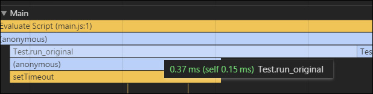
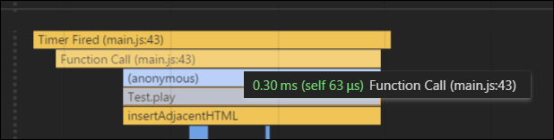
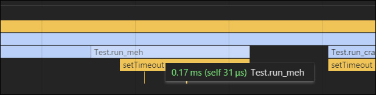
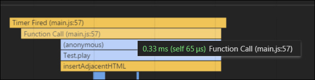
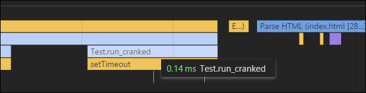
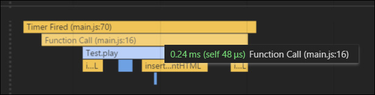
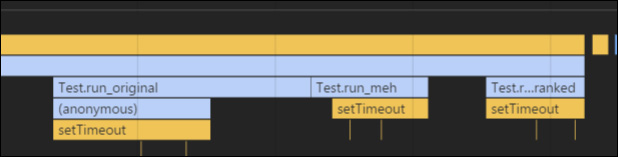

# js-closure-abuse
## An exploration into closures, execution scope, and Object.bind()

This [chunk of code](https://github.com/garvank/synth-js) looks incredibly complex and begs to be dissected.

```
Synth.prototype.sequence = function(queue, bpm, loops){

  // Get BPM delay in milliseconds
  var calculated_bpm = this.calculateBpm(bpm);

  // Play each sound, then wait for the offset
  for(i=0; i < queue.length; i++){
    ((function(offset){
      setTimeout((function(){
        this.play(queue[offset]);
      }).bind(this), offset * calculated_bpm)
    }).bind(this))(i);
  }
};
```

If you are just looking for the end result, here is what became of it:

```
for(i=0; i < queue.length; i++)
   setTimeout(this.show.bind(this, el, queue[i]), delay * i);
```

If you are curious how this came to be, keep reading!

---

**Technical Review**

The breakdown below is split into multiple sections. Each section has three sub-sections
- title / intro
- setTimeout call stack review
- callback call stack review.

---

### Original Code ([run_original()](js/main.js#L37-L48))

Let's break down the statements.

```
Test.prototype.run_original = function(el, queue, ms){

  var delay = ms;    

  for (i=0; i < queue.length; i++) {
    ((function(offset){
      setTimeout((function(){
        this.show(el, queue[offset]);
      }).bind(this), offset * delay);
    }).bind(this))(i);
  }
};
```

The mentality here is:
- Create closure around setTimeout with current index saved inside
- Create closure #2 and pass into setTimeout as callback, use saved index in delay value
  - Execute payload referencing the saved index value of the parent closure

Saving the index value into another variable inside the for loop is redundant. Same with binding *this* context multiple times. The mistake is to split binding arguments and *this* context discretely. The purpose of *bind()* is to preserve *this* context and arguments in one swoop.

From the [docs](https://developer.mozilla.org/en-US/docs/Web/JavaScript/Reference/Global_Objects/Function/bind):

> The bind() method creates a new function that, when called, has its this keyword set to the provided value, with a given sequence of arguments preceding any provided when the new function is called.

##### setTimeout Invocation Call Stack



We can see the function formed around setTimeout.

##### Callback Invocation Call Stack



Again we can see the function formed around the payload (Test.play) that was passed as the setTimeout argument.

The extra functino around setTimeout seems completely unnecessary. We only need to bind context and arguments once. Let's remove the outer function...

---

### SetTimeout Closure Removal ([run_meh()](js/main.js#L52-L61))

After stripping the wrapping function, we get:

```
Test.prototype.run_meh = function(el, queue, ms) {

  var delay = ms;

  for (i=0; i < queue.length; i++) {
    setTimeout((function(item) {
      this.show(el, item);
    }).bind(this, queue[i]), delay * i);
  }
};
```

This ends up still working just fine without any patching, since the index value and context will not change inside the for loop's execution scope. Sweet!

##### setTimeout Invocation Call Stack



Indeed the function wrapping setTimeout has been removed. Beautiful; one less jump for that poor CPU.

##### Callback Invocation Call Stack



We still need to bind context and arguements for the callback. As *bind()*'s job is to create a function, we don't need to manually create it ourselves.

Let's reduce that explicit function wrapper...

---

### Callback Closure Refactor ([run_cranked()](js/main.js#L65-L70))

Since every function's prototype is linked back to Object, we can utilize bind inherently:

```
Test.prototype.run_cranked = function(el, queue, ms) {

  var delay = ms;

  for (i=0; i < queue.length; i++)
    setTimeout( this.show.bind(this, el, queue[i]), delay * i );
};
```

That looks more declarative and easier to read. Mmmm mmmm mmm, sexyness! 

##### setTimeout Invocation Call Stack



Nothing changed here, naturally.

##### Callback Invocation Call Stack



The anonymous function is gone, perfect! Bind did it's job to preserve the object reference and argument values! Yay!

---

### Conclusion

Be careful creating extra layers of abstraction; make sure execution context is understood! Be as declarative as possible, this is a First Class Function language after all!

As a final comparison:

```
for(i=0; i < queue.length; i++){
  ((function(offset){
    setTimeout((function(){
      this.play(queue[offset]);
    }).bind(this), offset * calculated_bpm)
  }).bind(this))(i);
}
```
```
for (i=0; i < queue.length; i++)
  setTimeout( this.show.bind(this, el, queue[i]), delay * i );
```

Yes.

### Performance

Extra closures take cycles to deal with as shown in the image below. May not seem like much, but at large scale these can consume much needed resources.



### Demo

Because, you know, science and stuff: [JSFiddle](https://jsfiddle.net/ryunp/8nyq969t/) or [Github](http://ryunp.github.io/js-closure-abuse/)

### #FriendsDontLetFriendsDoubleWrap

Any mistakes or flaws? Let me know!